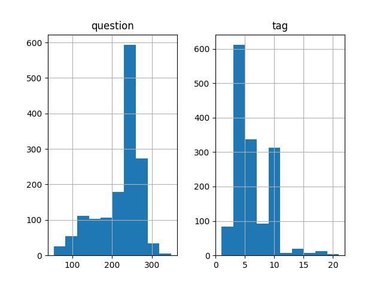
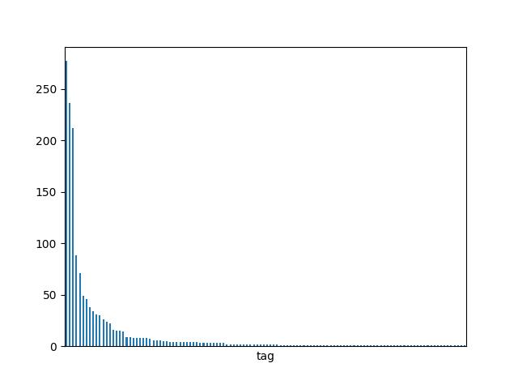
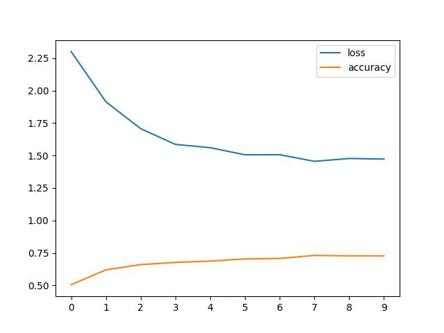

# Projet - dataset Stackoverflow

Ce projet vise à construire un classificateur automatique de questions StackOverflow. Ce corpus est construit pour fine-tuner un classifieur supervisé. Le cas d'usage est d'automatiquement catégoriser une nouvelle question publiée sur StackOverflow.

## Besoins du projet

Le projet vise à élaborer un classifieur automatique de questions liées à l'informatique posée à la communauté. Pour entraîner notre classifieur, nous avons besoin de questions et, pour chaque, d'une catégorie. La source de données choisie est Stackoverlow. Plus grand forum d'entre-aide entre développeurs, Stackoverflow propose en accès libre (sous licence CC BY-SA) un nombre important de questions-réponses en lien avec l'informatique. À chaque question est associée différentes étiquettes (ex: python, java, c++ etc.) Nous allons donc construire un crawler qui s'occupera de naviguer à travers les Q/A les plus populaires et récupérer, au fur et à mesure, le chapeau de la question (un court extrait) et sa première étiquette.

## Récupération des données

Les données sont scrapées grâce à la bibliothèque python [SeleniumBase](https://seleniumbase.io/) basée sur Selenium, une bibliothèque python permettant d'automatiser la manipulation de navigateurs webs. Le passage par selenium plutôt que des requêtes HTTP standards est nécessaire car StackOverflow se protège derrière un proxy CloudFlare. Celui-ci protège StackOverflow des crawlers.

Le processus de crawl est une itération à travers la liste des questions les mieux notées de la plateforme. Chaque page est enregistrée sur le disque. Dans un second temps, un script de scraping récupère dans chacune des pages d'une part le titre et l'extrait de la question, et d'autre part le _tag_ de la question.

Les pages HTML bruts ne sont pas directement utilisables pour notre entraînement. Pour chaque fichier HTML (un par publication), il faut extraire les questions et son étiquette principale. On utilise pour cela la bibliothèque BeautifulSoup : différents sélecteurs CSS permettent de récupérer le HTML du contenu de la question et celui de la première étiquette.

Le script du crawl se trouve dans `./scripts/process/crawl.py`.Les fichiers sont placés dans le sous-dossier `./data/raw`. Notre collecte est à hauteur de 15000 questions.

## Visualisation des données



On observe ci-dessus que les questions partagent une taille relativement stable, autour 250 caractères. Cela est logique, car il s'agit d'extraits tronqués automatiquement.



Ici, on observe que la distribution est fortement inégale entre les classes, avec quelques classes dominant toutes les autres. Cela peut avoir un impact sur l'entraînement de notre model : la sur-représentation de certaine classe peut avoir tendance à rendre difficile la détection des classes moins représentées dans notre dataset.

On observe la domination des _tags_ suivants (avec 120 tags différents en tout) :

```
javascript               277
python                   236
git                      212
java                      88
c#                        71
                        ...
apache-flex                1
ajax                       1
pdf                        1
model-view-controller      1
editor                     1
```

## Fine-tuning

Notre but est de classer nos questions avec un tag spécifique. Notre tâche ne demande pas à générer du texte ou autre. Pour cette raison, nous pouvons tirer profit d'un modèle de transformers proposant la seule partie _encoder_. Dans notre cas, nous avons opté pour BERT, un encoder transformer construit par Google et disponible depuis 2018. BERT est un modèle de plongement sémantique reposant sur la partie _encoder_ du transformers. Il permet d'obtenir un vecteur représentant une séquence de tokens et, se faisant, permet d'entraîner un dataset de classification.

Notre projet ré-implémente la méthode de fine-tuning [présentée par HuggingFace](https://huggingface.co/docs/transformers/en/training). Celle-ci détaille comment fine-tuner un modèle BERT à partir d'un dataset. Nous avons adapté ce guide à notre propre dataset (voir le script `./scripts/process/train.py`). Le fine-tuning a été fait sur 5 époques avec, pour chaque, une mesure d'_accuracy_ entre un sous-dataset _train_ et un sous-dataset _eval_ (part 80%/20%).

Le processus de finetuning montre la convergence suivante :



## Evaluation

Pour l'évaluation, nous avons appliqué notre modèle à notre sous-ensemble de test. Il en retourne les métriques suivantes (obtenu grâce au script `./scripts/plot/evaluation.py`) :

|Métrique|Valeur|
|---|---|
|Accuracy|0.78|
|Macro-moyenne|0.27|
|Micro-moyenne|0.74|

On observe ainsi une mesure d'_accuracy_ assez bonne (78%) avec une Micro-moyenne de F1 proche (74%). En revanche, la macro-moyenne est très mauvaise (27%). On peut expliquer ce mauvais score par la sur-représentation de très peu de classes (javascript, git, python, java). Quant aux classes sous-représentés, une erreur de classification les concernant influence grandement la macro-moyenne.

## Linting, formating et docstring

Le projet a fait l'objet d'un nettoyage grâce aux programmes `black` et `pylint`. Des docstring ont été rédigées pour chaque module, ainsi que pour chaque fonction. Github Copilot a été utilisé pour les docstring des fonctions **exclusivement** (surtout pas pour le code).
